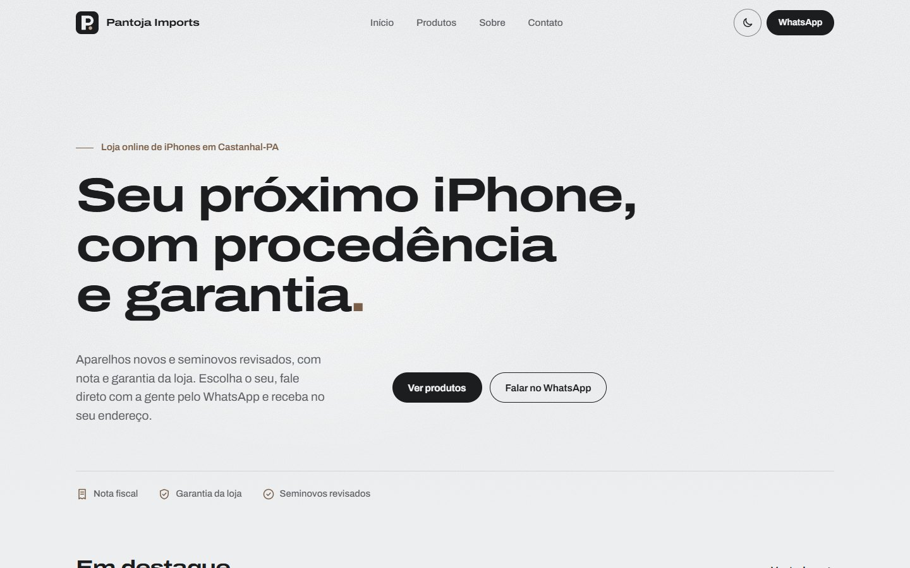

# Pantoja Imports

Vitrine online de uma loja de iPhones novos e seminovos em Castanhal-PA. Site estático em HTML, CSS e JavaScript puros, com catálogo gerado a partir de dados e pedidos encaminhados para o WhatsApp com a mensagem já escrita.

**Site:** https://pantoja-imports.lucasfigueiredo-bsilva.workers.dev/

| Desktop (tema claro) | Celular (tema escuro) |
| --- | --- |
|  |  |

## Funcionalidades

- **Catálogo a partir de dados**: os cards, os filtros por condição (novos, seminovos, acessórios) e os contadores são gerados a partir de uma lista de produtos.
- **Faixa "Em destaque"** com os produtos marcados como destaque; a seção some quando não há nenhum.
- **Galeria por produto**: arrastar no celular, indicadores no computador e miniaturas na tela de detalhes. Toda foto segue o mesmo enquadramento (4:5, preenchendo e centralizada). Produtos sem foto mostram um fundo neutro com o monograma da loja.
- **Modo recorte**: fotos com fundo transparente mostram o aparelho inteiro, centralizado, sobre um tom da cor dele.
- **Detalhes do produto em `<dialog>`**, que vira uma gaveta de baixo para cima no celular.
- **Pedido pelo WhatsApp**: cada botão abre a conversa com modelo, armazenamento, cor, condição e preço já preenchidos. Avaliação de troca e consulta de entrega têm mensagens próprias.
- **Bloco "Como funciona a entrega"** (área atendida, prazo, taxa e pagamento) alimentado pela configuração; campos vazios não aparecem.
- **Depoimentos opcionais**: a seção só existe na página quando há depoimentos cadastrados.
- **Tema claro e escuro**: segue o sistema na primeira visita e lembra a escolha feita no botão.
- **Botão flutuante de WhatsApp**, que aparece depois que o topo da página sai da tela.
- **SEO e compartilhamento**: título, descrição, URL canônica, Open Graph e ícones para navegador, iOS e Instagram.

## Tecnologias e decisões técnicas

- **HTML, CSS e JavaScript puros, sem framework e sem build.** É um site de poucas páginas com conteúdo que muda toda semana. Sem dependências, o carregamento fica rápido, a hospedagem é estática e qualquer ajuste é feito editando um arquivo de texto.
- **Catálogo gerado a partir de dados.** Os produtos ficam em `produtos.js` e os dados da loja num objeto `CONFIG` no topo do `script.js`. A interface é montada com template strings, e todo texto vindo dos dados passa por uma função de escape antes de entrar no HTML.
- **Mensagem de WhatsApp montada dinamicamente.** Os links usam `wa.me` com o texto gerado a partir do produto e codificado com `encodeURIComponent`. O número fica num único lugar.
- **`<dialog>` nativo para os detalhes.** `showModal()` já entrega foco preso dentro do modal, fechamento com Esc e fundo com `::backdrop`, sem biblioteca de modal.
- **`@property` para animar cores.** As cores do acabamento metálico são registradas como `<color>`. Assim o navegador consegue interpolá-las e os gradientes que dependem delas fazem a transição na troca de tema em vez de pular. Medindo com o trace do Chrome, propriedades registradas fazem as animações rodarem na thread principal, por isso as animações do site são curtas e só acontecem na entrada (nada fica animando sem parar).
- **Hero só com tipografia.** Sem foto nem ilustração: o título é o ponto de foco, com cada frase numa linha no computador, sobre fundo liso e um brilho neutro muito sutil.
- **Decoração em SVG usada como máscara CSS.** Os SVGs de `assets/decor/` definem só a forma; a cor vem do `background`, então o mesmo arquivo funciona nos dois temas.
- **Acessibilidade.** Link para pular ao conteúdo, foco visível, `aria-pressed` nos filtros, `aria-live` na grade, textos alternativos gerados a partir do produto, alvos de toque com no mínimo 44px, contraste AA e elementos decorativos com `aria-hidden`.
- **Modo escuro.** Cores em custom properties, trocadas por `prefers-color-scheme` ou pelo atributo `data-theme`. Um script inline no `<head>` aplica o tema salvo antes do CSS (sem "piscar" o tema errado) e a `theme-color` da barra do navegador acompanha.
- **`prefers-reduced-motion`.** Desliga as animações de entrada, o revelar ao rolar, o brilho da decoração e a rolagem suave.
- **Desempenho.** Fonte variável Archivo hospedada no próprio site (um arquivo para textos e títulos expandidos, com `preload`), imagens WebP com `width`/`height` declarados e carregamento sob demanda, e cache configurado no `_headers`. No Lighthouse em perfil de celular (medição local): 96 em desempenho e 100 em acessibilidade, boas práticas e SEO, com CLS 0.

## Estrutura de pastas

```
pantoja-imports/
├── index.html            estrutura da página, textos fixos, SEO e Open Graph
├── style.css             tokens (cores, espaços, raios), layout, temas e animações
├── script.js             CONFIG e DEPOIMENTOS no topo; abaixo, a lógica do site
├── produtos.js           lista de produtos da vitrine
├── wrangler.jsonc        configuração do Cloudflare Workers
├── _headers              cache e cabeçalhos de segurança
├── .assetsignore         arquivos que não são publicados
├── docs/                 screenshots deste README
└── assets/
    ├── fontes/           Archivo (fonte variável)
    ├── produtos/         fotos dos aparelhos (WebP 1200x1500)
    ├── decor/            SVGs decorativos usados como máscara (usinado, régua, granulado)
    ├── icone-conceitos/  conceitos alternativos do ícone e prancha de comparação
    ├── logo.svg          ícone da loja (fonte dos PNGs)
    ├── favicon.svg       ícone da aba, ajustado para 16px
    ├── favicon-16.png, favicon-32.png, apple-touch-icon.png, logo-512.png
    ├── logo-instagram.svg / .png   foto de perfil 1080x1080
    └── og-image.png      imagem de compartilhamento 1200x630
```

## Como rodar localmente

Não há build nem dependências. Basta servir a pasta com qualquer servidor estático:

```bash
python -m http.server 8000
# ou
npx serve .
```

Depois, acesse `http://localhost:8000`. Abrir o `index.html` direto do disco também funciona, mas o navegador bloqueia a fonte e as máscaras decorativas em endereços `file://`.

## Como atualizar o catálogo e os dados da loja

**Produtos** ficam em `produtos.js`. Cada produto é um objeto na lista `PRODUTOS`, e a ordem da lista é a ordem no site.

| Campo | Descrição |
| --- | --- |
| `modelo` | nome exibido no card (ex.: `'iPhone 15 Pro'`) |
| `armazenamento` | ex.: `'256 GB'` (vazio em acessórios) |
| `cor` | nome da cor |
| `condicao` | `'novo'`, `'seminovo'` ou `'acessorio'` |
| `bateria` | saúde da bateria em %, só em seminovos |
| `preco` | número em reais, ou `null` para exibir "Consulte" |
| `selo` | etiqueta curta sobre a foto (ex.: `'Oportunidade'`) |
| `destaque` | `true` inclui o produto na faixa "Em destaque" |
| `fotos` | caminhos em `assets/produtos/`; a primeira é a principal. Aceita `{ src, alt }` |
| `recorte` | `true` quando as fotos têm fundo transparente: o aparelho aparece inteiro sobre a cor dele |
| `corHex` | cor do aparelho em hexadecimal (ex.: `'#efcfcd'`), usada no fundo do modo recorte |
| `detalhes` | itens listados na tela de detalhes |

Fotos: WebP, 1200x1500 px (4:5), nomes sem espaço nem acento. Para o modo recorte, use PNG ou WebP com fundo transparente e o aparelho ocupando a maior parte do quadro.

**Dados da loja** ficam no objeto `CONFIG`, no topo do `script.js`: nome, número do WhatsApp (só dígitos, com DDI e DDD), Instagram e outras redes, horário de atendimento, dados de entrega (`entrega.area`, `entrega.prazo`, `entrega.taxa`, `entrega.pagamento`), CNPJ, texto de parcelamento e as mensagens prontas do WhatsApp. Todos os botões usam esses valores automaticamente.

**Depoimentos** ficam no array `DEPOIMENTOS`, logo abaixo do `CONFIG`, no formato `{ nome, detalhe, texto }`. Com o array vazio, a seção não aparece.

**Outros pontos de manutenção**

- Título, descrição e Open Graph ficam no `<head>` do `index.html`.
- Cores, espaçamentos e raios ficam no bloco `:root` do `style.css`, com as cores do tema escuro logo abaixo.
- Os PNGs do ícone são exportados a partir de `assets/logo.svg`.
- Para usar uma foto no topo da página, adicione a classe `hero--com-foto` na seção do hero e descomente o bloco `<figure class="hero__foto">`. O layout passa a ter duas colunas, com o texto à esquerda e a foto à direita.

## Deploy

Hospedado no **Cloudflare Workers** como site estático: o `wrangler.jsonc` publica a raiz do repositório como está, sem etapa de build. O repositório está conectado ao Cloudflare, então **cada push na branch `main` gera um deploy automático**.

- `_headers`: HTML, CSS e JS sempre revalidados; imagens com cache de 1 dia; fontes com cache de 1 ano. Inclui cabeçalhos de segurança.
- `.assetsignore`: arquivos do repositório que não são publicados (configurações, README, `.git`).

## Autor

**Lucas Figueiredo**: [github.com/LucasFigueiredo23](https://github.com/LucasFigueiredo23)

---

iPhone é marca registrada da Apple Inc. Este projeto não é afiliado à Apple.
